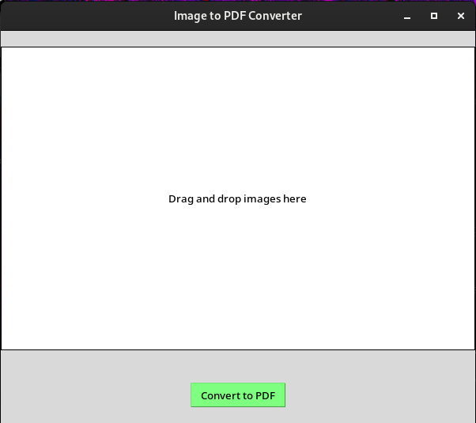

<h2 align="center">
convertIMGtoPDF
</h2>

<h3 align="center">
Installation
</h3>

- Clone the repository by :
`git clone https://github.com/pruka/convertIMGtoPDF.git && cd convertIMGtoPDF`
- Install requirements by :
`pip3 install -U -r requirements.txt`
- Granting execute permission to <i>launcher.sh</i>:
`chmod +x launcher.sh`
- Running launcher.sh:
`./launcher.sh`

